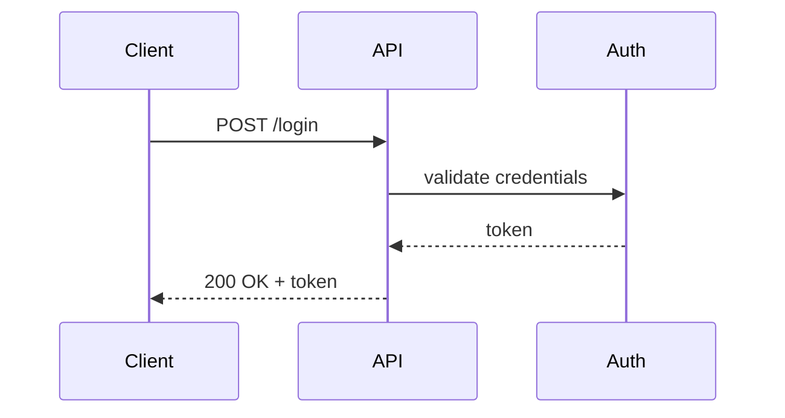

# AI-Friendly Architecture Documentation Standard (AFADS)

Version: 0.1  
Status: Draft / Working Standard  
Last updated: 2026-02-06
Author: Sebastian Mang

## 1. Purpose

This standard defines how we document architecture for solutions that consist of:
- multiple repositories
- both infrastructure and application components
- Kubernetes + cloud hosting (e.g. OVH)
- GitOps-based deployment (e.g. Argo CD)
- published documentation (e.g. Wiki.js)

The goal is to produce documentation that is:
- **human-readable**
- **AI-readable**
- **consistent across repos**
- **easy to maintain**
- **good for onboarding and future sessions**
- **usable as long-term architectural memory**

This standard assumes that AI sessions may start without prior context, and should be able to rebuild understanding by reading the documentation.

---

## 2. Core Principles

### 2.1 One system, many repos
Even if the implementation spans many repositories, we treat the solution as **one system**.

### 2.2 Docs live close to the code
Each repository must contain the docs needed to understand and operate that component.

### 2.3 A system-level docs hub composes everything
A dedicated docs repository acts as the “architecture hub”:
- provides the system-level narrative
- holds system-level ADRs
- indexes component docs from all repos
- publishes everything to Wiki.js

### 2.4 Avoid duplication
We do not copy-paste component docs into system docs.
Instead, the hub repo references and/or aggregates component docs.

### 2.5 Stable identifiers beat prose
Architecture docs must use stable IDs for:
- components
- environments
- namespaces
- Argo CD applications
- Helm releases

This makes the documentation queryable and durable.

---

## 3. Documentation Layers

### 3.1 Component Documentation (per repo)
Each repo documents:
- what it does
- how it is deployed
- how it is operated
- its interfaces and dependencies

This is “local truth”.

### 3.2 System Documentation (docs hub repo)
The docs hub repo documents:
- the full system architecture
- cross-cutting concerns (security, observability, backups, networking)
- deployment topology
- runtime flows
- system-level ADRs

This is “global truth”.

---

## 4. Repository Standard (Per Component Repo)

Each repository MUST include:

```
docs/
  index.md
  ecosystem.md
  component.md
  runbook.md
```

Each repository SHOULD include:

```
docs/
  adrs/
  diagrams/
```

### 4.1 docs/index.md (Required)

Landing page for the component's documentation directory. This file serves as the entry point when browsing documentation — whether in a docs hub, a wiki, or a static site generator.

Required content:

- Component name as heading
- Links to `component.md`, `runbook.md`, and any other documentation in the directory
- Brief one-line description of the component

Example:

```markdown
# API Service

Backend API for the application platform.

- [Ecosystem](ecosystem.md) - Standards, related repos, and project context
- [Component](component.md) - Architecture, interfaces, and dependencies
- [Runbook](runbook.md) - Operations and deployment procedures
- [ADRs](adrs/) - Architecture decision records
```

### 4.2 docs/ecosystem.md (Required)

This file tells an AI agent (or new team member) where to find the documentation standards, the architecture hub, and all related repositories. It is the first file an AI agent should read when entering a repository for the first time.

The goal is that any repo can serve as an entry point: the agent reads `ecosystem.md` and immediately knows the full project context, where the standards live, and how to navigate to every other repo.

#### Required structure

##### Standards reference

How to find the documentation standards that this repo follows. The agent should try the local path first (fastest, works offline), then fall back to the repository URL.

##### Architecture hub

Which repository is the main architecture/docs hub for the application this component belongs to. This is the repo that contains system-level docs, `components.yaml`, and the architecture narrative.

##### Related repositories

A table of all repositories that belong to the same application or are shared dependencies. Each entry includes the repo's role, its local path, its remote URL, and whether it is application-specific or shared.

##### Application scope

Which application(s) this repository belongs to. Some repositories are application-specific (they serve exactly one application). Others are shared (they serve multiple applications, like a shared library or infrastructure repo).

#### Example

```markdown
# Ecosystem

## Standards

This repository follows the documentation standards defined in:

- **Local path:** `/Users/developer/repos/llm-architecture-standard`
- **Repository:** `https://github.com/<org>/llm-architecture-standard`

Standards used: AFADS, AFOPS, AFPS, AFSS

## Architecture Hub

The main architecture repository for this application:

- **Repo:** mb-architecture
- **Local path:** `/Users/developer/repos/mb-architecture`
- **Repository:** `https://github.com/<org>/mb-architecture`
- **Docs entry point:** `docs/architecture/ai-handoff.md`

## Related Repositories

| Repo | Role | Local Path | Remote URL | Scope |
|------|------|------------|------------|-------|
| mb-architecture | Architecture hub / system docs | `/Users/developer/repos/mb-architecture` | `https://github.com/<org>/mb-architecture` | martialbook |
| mb-webapp | SvelteKit web application | `/Users/developer/repos/mb-webapp` | `https://github.com/<org>/mb-webapp` | martialbook |
| mb-supabase | Supabase configuration and migrations | `/Users/developer/repos/mb-supabase` | `https://github.com/<org>/mb-supabase` | martialbook |
| purplegreen-ui | Shared UI component library | `/Users/developer/repos/purplegreen-ui` | `https://github.com/<org>/purplegreen-ui` | shared |
| purplegreen-infra | Shared infrastructure (Terraform/K8s) | `/Users/developer/repos/purplegreen-infra` | `https://github.com/<org>/purplegreen-infra` | shared |

## Application Scope

This repository is **application-specific** to: **martialbook**

<!-- For shared repos, use instead:
This repository is **shared** across: martialbook, <other-app>
-->
```

#### Field definitions

| Field | Description |
|-------|-------------|
| **Repo** | Short repo name (used as human-readable identifier) |
| **Role** | What this repo does (architecture hub, web app, library, infra, etc.) |
| **Local path** | Absolute path where this repo is typically cloned. The AI agent tries this first. |
| **Remote URL** | Git remote URL (HTTPS or SSH). The AI agent uses this if the local path is not found. |
| **Scope** | `shared` if the repo serves multiple applications, or the application name if application-specific |

#### Rules

- Every repository in the ecosystem MUST appear in the Related Repositories table of every other repository in the ecosystem.
- The **architecture hub** MUST be explicitly identified. There is exactly one architecture hub per application.
- **Local paths** are developer-specific and MAY differ between machines. They serve as a fast-path hint for AI agents. If the path does not exist, the agent MUST fall back to the remote URL.
- **Shared repositories** MUST list all applications they serve in the Application Scope section.
- When a new repo is added to the ecosystem, all existing repos' `ecosystem.md` files MUST be updated.

### 4.3 docs/component.md (Required)

This file describes the component in a standard format.

#### Required structure

##### Header metadata block
At the top of the file, include:

- component_id (stable identifier)
- component_name
- owner/team
- repo
- type (service, infra, library, job, helm-chart, terraform, etc.)
- deployed_as (helm release name, kustomize app, systemd unit, etc.)
- namespace (if applicable)
- environments (dev/stage/prod)
- depends_on (list of component_ids)
- exposes (ports, endpoints, events)
- consumes (ports, endpoints, events)

Example:

```yaml
component_id: supabase-auth
component_name: Supabase Auth
owner: platform
repo: github.com/<org>/supabase-auth
type: service
deployed_as: helm
namespace: supabase
environments: [dev, prod]
depends_on:
  - supabase-postgres
exposes:
  - http:8080
consumes:
  - postgres://supabase-postgres:5432
```

##### Body sections
After the metadata header, the document MUST include:

1. Overview
2. Responsibilities
3. Interfaces
4. Dependencies
5. Configuration (env vars, secrets, configmaps)
6. Deployment model
7. Operational notes
8. Known risks / limitations

---

### 4.4 docs/runbook.md (Required)

This file describes how to operate the component.

Minimum sections:
1. Deploy / upgrade procedure
2. Rollback procedure
3. Health checks
4. Common incidents
5. Logs and monitoring
6. Backup/restore (if applicable)
7. Disaster recovery notes

---

### 4.5 docs/adrs/ (Optional)

Use ADRs if the component contains local design decisions.

Rules:
- ADRs MUST use sequential IDs: `0001-<title>.md`
- ADRs MUST use the standard ADR template (see section 6)

---

## 5. System Documentation Standard (Docs Hub Repo)

The docs hub repo MUST contain:

```
docs/
  architecture/
    00-orientation.md
    01-context.md
    02-containers.md
    03-deployment.md
    04-runtime-flows/
    05-security.md
    06-ops.md
    glossary.md
    ai-handoff.md
    adrs/
  ecosystem.yaml
  components.yaml
```

### 5.1 docs/architecture/00-orientation.md
Defines:
- system purpose
- goals / non-goals
- constraints (budget, compliance, performance, uptime)
- environments (dev/stage/prod)
- quality attributes (security, availability, maintainability)
- key risks

### 5.2 docs/architecture/01-context.md (C4 L1)
Defines:
- system context diagram (human users + external systems)
- trust boundaries
- key integrations

### 5.3 docs/architecture/02-containers.md (C4 L2)
Defines:
- all major deployable units (services, databases, controllers, ingress, etc.)
- responsibilities per container
- dependencies between containers
- component_id mapping

### 5.4 docs/architecture/03-deployment.md
Defines:
- OVH + Kubernetes topology
- node pools / VM layout
- networking
- ingress model
- DNS and certificates
- storage classes and persistence strategy
- backup strategy
- Argo CD layout (apps, repos, sync model)

### 5.5 docs/architecture/04-runtime-flows/
Contains one markdown file per key flow, for example:
- `login.md`
- `file-upload.md`
- `realtime.md`
- `backup-restore.md`

Each flow MUST include:
- a short narrative
- the components involved (component_ids)
- sequence diagram or step-by-step list
- failure modes

### 5.6 docs/architecture/05-security.md
Defines:
- threat model summary
- trust boundaries
- secret management
- IAM model
- network policy model
- ingress exposure
- audit logging strategy

### 5.7 docs/architecture/06-ops.md
Defines:
- monitoring
- logging
- alerting
- upgrade strategy
- rollback strategy
- maintenance windows
- DR and recovery objectives

### 5.8 docs/architecture/glossary.md
Defines:
- domain terms
- component IDs
- abbreviations

### 5.9 docs/architecture/ai-handoff.md
This is a **session continuity file** for humans and AI.

It MUST include:
- current status of the system
- current architecture assumptions
- current issues
- top risks
- next 3–10 planned tasks
- links to the most important docs

This file SHOULD be short (1–2 pages).

---

## 6. ADR Standard (System and Component Level)

### 6.1 ADR naming
All ADRs MUST be named:

```
NNNN-short-title.md
```

Example:
- `0007-ingress-controller-choice.md`

### 6.2 ADR template
All ADRs MUST use:

```markdown
# ADR NNNN: <Title>

Date: YYYY-MM-DD  
Status: Proposed | Accepted | Deprecated | Superseded  
Deciders: <names/roles>  

## Context
What problem are we solving? What forces/constraints exist?

## Decision
What did we decide?

## Consequences
What changes because of this? What are trade-offs?

## Alternatives considered
List options and why they were rejected.

## Links
Links to PRs, issues, diagrams, docs, etc.
```

### 6.3 Where ADRs live
- System-level ADRs live in: `docs/architecture/adrs/`
- Component-level ADRs live in: `<repo>/docs/adrs/`

---

## 7. Component Registry (docs hub repo)

The docs hub repo MUST contain:

```
docs/components.yaml
```

This file is used by CI/CD to aggregate component docs into Wiki.js.

### 7.1 Required schema (minimum)

Example:

```yaml
components:
  - component_id: supabase-postgres
    name: Supabase Postgres
    repo: github.com/<org>/supabase-postgres
    ref: main
    docs:
      component: docs/component.md
      runbook: docs/runbook.md

  - component_id: ingress-nginx
    name: Ingress NGINX
    repo: github.com/<org>/cluster-addons
    ref: main
    docs:
      component: docs/ingress-nginx/component.md
      runbook: docs/ingress-nginx/runbook.md
```

### 7.2 Notes
- `component_id` MUST match the IDs used in architecture docs.
- `ref` MAY be pinned to a tag/commit for stable releases.
- The hub publishing pipeline MAY fail if required docs are missing.

---

## 8. Ecosystem Registry (docs hub repo)

The docs hub repo MUST contain an ecosystem registry that lists all repositories belonging to the application, plus any shared repositories it depends on.

```
docs/ecosystem.yaml
```

This file is the single source of truth for the full set of repos in the ecosystem. Individual repos' `docs/ecosystem.md` files are derived from this registry.

### 8.1 Required schema

```yaml
application: martialbook
standards_repo:
  name: llm-architecture-standard
  local_path: /Users/developer/repos/llm-architecture-standard
  remote_url: https://github.com/<org>/llm-architecture-standard

architecture_hub: mb-architecture

repositories:
  - name: mb-architecture
    role: Architecture hub / system docs
    local_path: /Users/developer/repos/mb-architecture
    remote_url: https://github.com/<org>/mb-architecture
    scope: martialbook

  - name: mb-webapp
    role: SvelteKit web application
    local_path: /Users/developer/repos/mb-webapp
    remote_url: https://github.com/<org>/mb-webapp
    scope: martialbook

  - name: mb-supabase
    role: Supabase configuration and migrations
    local_path: /Users/developer/repos/mb-supabase
    remote_url: https://github.com/<org>/mb-supabase
    scope: martialbook

  - name: purplegreen-ui
    role: Shared UI component library
    local_path: /Users/developer/repos/purplegreen-ui
    remote_url: https://github.com/<org>/purplegreen-ui
    scope: shared
    applications: [martialbook]

  - name: purplegreen-infra
    role: Shared infrastructure (Terraform/K8s)
    local_path: /Users/developer/repos/purplegreen-infra
    remote_url: https://github.com/<org>/purplegreen-infra
    scope: shared
    applications: [martialbook]
```

### 8.2 Field reference

| Field | Required | Description |
|-------|----------|-------------|
| `application` | Yes | The application name this docs hub serves |
| `standards_repo` | Yes | Where the documentation standards (AFADS, AFOPS, AFPS, AFSS) are defined |
| `standards_repo.local_path` | Yes | Absolute path where the standards repo is cloned. AI agents try this first. |
| `standards_repo.remote_url` | Yes | Git remote URL. AI agents fall back to this if local path is not found. |
| `architecture_hub` | Yes | The `name` of the repo that is the architecture hub (must match one entry in `repositories`) |
| `repositories[].name` | Yes | Short repo name (human-readable identifier) |
| `repositories[].role` | Yes | What this repo does |
| `repositories[].local_path` | Yes | Absolute path where this repo is typically cloned |
| `repositories[].remote_url` | Yes | Git remote URL (HTTPS or SSH) |
| `repositories[].scope` | Yes | `shared` if the repo serves multiple applications, or the application name if application-specific |
| `repositories[].applications` | If shared | List of application names that use this shared repo |

### 8.3 Rules

- There MUST be exactly one `architecture_hub` per application.
- Every repo listed in `repositories` MUST have a `docs/ecosystem.md` that is consistent with this registry.
- Shared repositories (`scope: shared`) MUST list all applications they currently serve in the `applications` field.
- When a shared repo is adopted by a new application, both the new application's `ecosystem.yaml` and the shared repo's `ecosystem.md` MUST be updated.
- `local_path` values are developer-specific defaults. They MAY differ per machine. AI agents MUST treat them as hints: try the local path first, fall back to the remote URL.

### 8.4 How AI agents should use the ecosystem registry

When an AI agent starts a session in any repository:

1. Read `docs/ecosystem.md` in the current repo.
2. Try to access the standards repo at the local path. If not found, use the remote URL.
3. Read the standards to understand the documentation conventions.
4. Try to access the architecture hub at the local path. If not found, use the remote URL.
5. Read `docs/architecture/ai-handoff.md` in the architecture hub to get system-level context.
6. Use the Related Repositories table to navigate to other repos as needed.

---

## 9. Publishing Model

The docs hub repo is published to Wiki.js using:
- GitHub Actions (aggregation + publishing)
- Argo CD (if the publishing stack itself is deployed via GitOps)

### 9.1 Publishing goals
- A reader must be able to browse system architecture first.
- From the system docs, readers must be able to click through to component docs.
- The system architecture must remain readable even if individual repos change.

---

## 10. Diagram Standard

### 10.1 C4 model

We use C4 as the default diagram structure:

- L1: System Context
- L2: Containers (deployable units)
- L3: Components (inside a container/service)
- L4: Code (optional)

### 10.2 General rules

- **Prefer text-based, open formats.** Diagrams MUST be stored as source in a version-controllable, diffable format. Avoid binary-only diagram files (Visio, Lucidchart exports, PNGs without source).
- **Diagrams MUST be wiki-renderable.** If the source format cannot be rendered directly by common wikis (e.g. Wiki.js, GitHub, GitLab), an exported SVG MUST be stored alongside the source file.
- **One source of truth.** The text/XML source is the canonical version. The SVG is a rendered artifact. If they diverge, the source wins.

### 10.3 Diagram formats

Preferred formats, in order:

| Format | Use case | Wiki-renderable | Notes |
|--------|----------|-----------------|-------|
| Mermaid | Sequence diagrams, flowcharts, C4 (via C4 extension) | Yes (most wikis) | Embedded directly in markdown code blocks |
| Structurizr DSL | C4 architecture diagrams | No | Export SVG alongside `.dsl` files |
| draw.io / diagrams.net (`.drawio`) | Complex visual diagrams, network topologies | No | Export SVG alongside `.drawio` files (see 10.4) |
| Markdown tables | Inventories, simple matrices | Yes | Use for anything that doesn't need a visual diagram |

Formats to avoid:

| Format | Reason |
|--------|--------|
| Visio (`.vsdx`) | Proprietary, binary, not diffable |
| PNG/JPG without source | No way to edit, not diffable, lossy |
| PDF diagrams | Not editable, not diffable |
| Lucidchart (cloud-only) | No local source file, vendor lock-in |

### 10.4 draw.io / diagrams.net convention

When using draw.io files:

1. Store the `.drawio` source file in `docs/diagrams/`.
2. Export an SVG of every page/tab and store it next to the source file with the same base name.
3. Reference the SVG (not the `.drawio` file) in documentation.

```
docs/diagrams/
  network-topology.drawio       ← source (editable)
  network-topology.svg          ← exported render (wiki-friendly)
  deployment-overview.drawio
  deployment-overview.svg
```

When updating a diagram, update both the `.drawio` source and re-export the SVG. CI MAY enforce that SVGs are not stale relative to their `.drawio` source.

### 10.5 Mermaid convention

Mermaid diagrams SHOULD be embedded directly in markdown files using fenced code blocks:

````markdown

````

For complex Mermaid diagrams that are reused across multiple documents, store the diagram in `docs/diagrams/<name>.mmd` and reference it.

---

## 11. Kubernetes + GitOps Conventions (Recommended)

To improve architecture traceability, the system SHOULD define:

- namespaces per domain/system area
- Argo CD application naming standard
- Helm release naming standard
- secret management standard
- backup standard (Postgres + object storage)
- upgrade strategy for Supabase components

---

## 12. Definition of Done (Documentation)

A component is considered "documented" when:
- `docs/ecosystem.md` exists and references the standards repo, architecture hub, and related repos
- `docs/component.md` exists and follows the structure
- `docs/runbook.md` exists and is usable
- it is registered in `docs/components.yaml`
- the system docs reference it by `component_id`

The system is considered "architecturally documented" when:
- all system-level files exist in `docs/architecture/`
- `docs/ecosystem.yaml` exists and lists all repos in the ecosystem
- the C4 L1 and L2 views are present
- system-level ADRs exist for key decisions
- `ai-handoff.md` is current

---

## 13. How AI Should Use This Standard

When an AI session starts in any repository, it should:

1. Read `docs/ecosystem.md` in the current repo to find the standards repo and architecture hub
2. Try to access the standards repo at the local path; if not found, use the remote URL
3. Read the standards (AFADS, AFOPS, AFPS, AFSS) to understand documentation conventions
4. Try to access the architecture hub at the local path; if not found, use the remote URL
5. Read `docs/architecture/ai-handoff.md` in the architecture hub
6. Read `docs/architecture/00-orientation.md`
7. Read `docs/architecture/01-context.md`
8. Read `docs/architecture/02-containers.md`
9. Read `docs/architecture/03-deployment.md`
10. Review system ADRs in `docs/architecture/adrs/`
11. Use `docs/components.yaml` to locate component docs
12. Use `docs/ecosystem.yaml` to discover all related repos
13. Read component docs only as needed

---

## 14. Future Extensions (Optional)

Possible additions:
- automatic extraction of Argo CD inventory into docs
- automatic generation of dependency graphs from component metadata
- policy-as-code references (OPA/Gatekeeper, Kyverno)
- threat modeling templates (STRIDE, LINDDUN)
- SLO and error budget templates

---

## 15. Summary

This standard provides:
- a stable system architecture memory
- consistent component documentation across repos
- an ecosystem registry for cross-repo discovery and navigation
- decision traceability through ADRs
- compatibility with GitOps and multi-repo systems
- a structure that both humans and AI can reliably use
